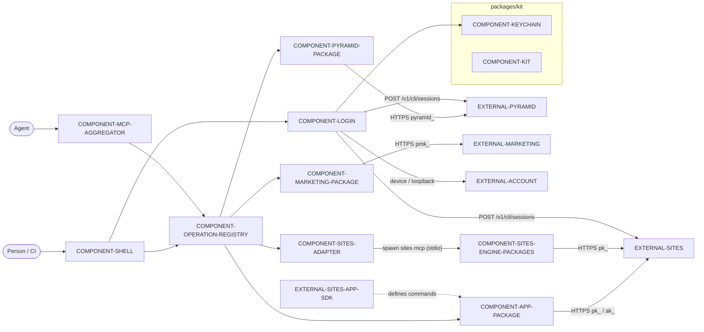

# Architecture

```mermaid
flowchart LR
  person([Person / CI]) --> COMPONENT-SHELL
  agent([Agent]) --> COMPONENT-MCP-AGGREGATOR
  COMPONENT-SHELL --> COMPONENT-OPERATION-REGISTRY
  COMPONENT-MCP-AGGREGATOR --> COMPONENT-OPERATION-REGISTRY
  COMPONENT-SHELL --> COMPONENT-LOGIN
  COMPONENT-LOGIN --> COMPONENT-KEYCHAIN
  subgraph kit [packages/kit]
    COMPONENT-KIT
    COMPONENT-KEYCHAIN
  end
  COMPONENT-OPERATION-REGISTRY --> COMPONENT-PYRAMID-PACKAGE
  COMPONENT-OPERATION-REGISTRY --> COMPONENT-MARKETING-PACKAGE
  COMPONENT-OPERATION-REGISTRY --> COMPONENT-APP-PACKAGE
  COMPONENT-OPERATION-REGISTRY --> COMPONENT-SITES-ADAPTER
  COMPONENT-SITES-ADAPTER -- "spawn sites mcp (stdio)" --> COMPONENT-SITES-ENGINE-PACKAGES
  COMPONENT-PYRAMID-PACKAGE -- "HTTPS pyramid_" --> EXTERNAL-PYRAMID
  COMPONENT-MARKETING-PACKAGE -- "HTTPS pmk_" --> EXTERNAL-MARKETING
  COMPONENT-APP-PACKAGE -- "HTTPS pk_ / ak_" --> EXTERNAL-SITES
  COMPONENT-SITES-ENGINE-PACKAGES -- "HTTPS pk_" --> EXTERNAL-SITES
  COMPONENT-LOGIN -- "device / loopback" --> EXTERNAL-ACCOUNT
  COMPONENT-LOGIN -- "POST /v1/cli/sessions" --> EXTERNAL-SITES
  COMPONENT-LOGIN -- "POST /v1/cli/sessions" --> EXTERNAL-PYRAMID
  EXTERNAL-SITES-APP-SDK -. "defines commands" .-> COMPONENT-APP-PACKAGE
```

Native products run in-process; Sites runs as a child process from its platform package. Every product call carries a product-local key; only `magic login` talks to Account.
