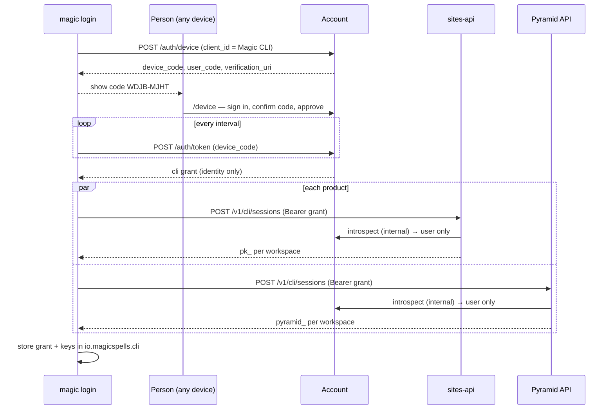

# Login

```mermaid
sequenceDiagram
  participant CLI as magic login
  participant Browser as Person (any device)
  participant Account as Account
  participant Sites as sites-api
  participant Pyramid as Pyramid API
  CLI->>Account: POST /auth/device (client_id = Magic CLI)
  Account-->>CLI: device_code, user_code, verification_uri
  CLI-->>Browser: show code WDJB-MJHT
  Browser->>Account: /device — sign in, confirm code, approve
  loop every interval
    CLI->>Account: POST /auth/token (device_code)
  end
  Account-->>CLI: cli grant (identity only)
  par each product
    CLI->>Sites: POST /v1/cli/sessions (Bearer grant)
    Sites->>Account: introspect (internal) → user only
    Sites-->>CLI: pk_ per workspace
  and
    CLI->>Pyramid: POST /v1/cli/sessions (Bearer grant)
    Pyramid->>Account: introspect (internal) → user only
    Pyramid-->>CLI: pyramid_ per workspace
  end
  CLI->>CLI: store grant + keys in io.magicspells.cli
```

Account says who the person is; each product decides what they may do and issues its own key.
